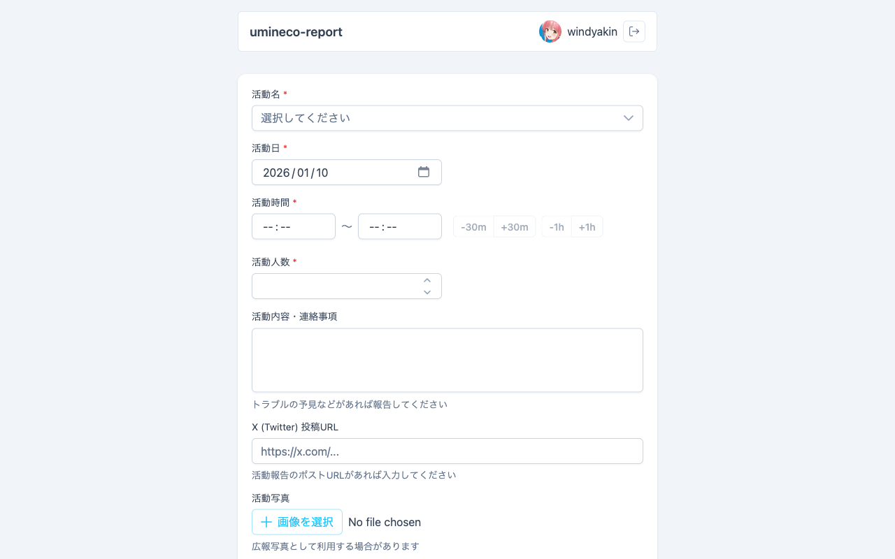

# Discord Report

活動報告投稿システム。 Discord OAuth2 で認証し、許可されたメンバーが活動報告を Discord チャンネルに投稿することができます。



## 機能

- Discord OAuth2認証
- サーバー・ロールベースの認可
- 活動報告フォーム
- Discord Embed としてチャンネルに自動投稿

## 技術スタック

| 領域 | 技術 |
|------|------|
| Backend | Express.js, Passport.js, ES Modules |
| Frontend | Vue 3, Vite, PrimeVue 4, Pinia |
| Infrastructure | Docker, nginx |

## セットアップ

### 前提条件

- Node.js 22+
- Discord Application（OAuth2 + Bot）

### Discord Applicationの設定

1. [Discord Developer Portal](https://discord.com/developers/applications)でアプリケーションを作成
2. OAuth2のリダイレクトURLを設定: `http://localhost:5173/auth/discord/callback`
3. Botを作成し、対象サーバーに招待（`guilds.members.read`スコープが必要）

### 環境変数

`backend/.env`を作成し、以下の内容を設定します。 `.env.example` を参考に利用できます。

| 変数名 | 説明 |
|--------|------|
| `DISCORD_CLIENT_ID` | OAuth2 クライアントID |
| `DISCORD_CLIENT_SECRET` | OAuth2 クライアントシークレット |
| `DISCORD_BOT_TOKEN` | Bot トークン（メンバー/ロール確認用） |
| `ALLOWED_GUILD_ID` | 許可するギルド（サーバー）のID |
| `ALLOWED_ROLE_ID` | 許可するロールのID |
| `POST_CHANNEL_ID` | 報告を投稿するチャンネルのID |
| `SESSION_SECRET` | Express セッション用シークレット |

### インストール

```bash
npm install
```

### 開発

```bash
# Backend + Frontend を同時に起動
npm run dev

# 個別に起動
npm run dev:backend   # http://localhost:3000
npm run dev:frontend  # http://localhost:5173
```

### テスト

```bash
npm run test      # Watch mode
npm run test:run  # Single run
```

### ビルド

```bash
npm run build
```

## frontend から backend へのルーティングについて

frontend 宛のリクエストについて `/auth` および `/api` へのリクエストは backend にプロキシされる必要があります。

### ローカル環境

ローカル環境では [`vite.config.js`](frontend/vite.config.js) の `proxy` 設定を確認してください。

### コンテナ環境（本番）

コンテナ環境では nginx から環境変数で指定されたバックエンドURLにプロキシされます。

必要に応じて環境変数 `BACKEND_HOST` `BACKEND_PORT` を設定してください。

## Docker

### ビルド

```bash
# Backend
docker build -f backend/Dockerfile -t discord-report-backend .

# Frontend
docker build -f frontend/Dockerfile -t discord-report-frontend .
```

### 実行

```bash
# Backend
docker run -p 3000:3000 --env-file backend/.env discord-report-backend

# Frontend (BACKEND_URLはバックエンドのURL)
docker run -p 80:80 -e BACKEND_URL=http://backend:3000 discord-report-frontend
```

## CI/CD

GitHub Actionsでmainブランチへのpush時に自動でコンテナイメージをビルドし、GitHub Container Registry (ghcr.io)にpushします。

イメージ:
- `ghcr.io/numazu-umineco/discord-report/backend`
- `ghcr.io/numazu-umineco/discord-report/frontend`

## License

[MIT License](LICENSE)

## Copyright

© 2023 umineco
